# トレ録 使い方

自宅でやったトレーニングを、その場で残しておくための記録帳です。
スマホのブラウザで開いて、ホーム画面に追加すれば、それがインストールです。
アカウント登録はありません。サーバーもありません。記録は、あなたのスマホの中に保存されます。外に保存されたり、外に出たりすることはありません。

このページの画面は、すべて架空の例（呼び名「たなか」・動画の題名・種目）で撮ったものです。動画のサムネイルは「動画のサムネイル（例）」という灰色の板に置き換えています。

**開く場所：** https://memory2meaning-lgtm.github.io/toreroku/

---

## 目次

1. [入れ方（iPhone／Android）](#1-入れ方)
2. [はじめて開いたときの三つの問い](#2-はじめて開いたときの三つの問い)
3. [トレーニングメニューを作る](#3-トレーニングメニューを作る)
4. [やった日に記録する](#4-やった日に記録する)
5. [過去の日を直す](#5-過去の日を直す)
6. [ふだんは外す](#6-ふだんは外す)
7. [記録を残す（書き出し・機種変更）](#7-記録を残す書き出し機種変更)
8. [相棒と呼び名](#8-相棒と呼び名)
9. [よくある質問](#9-よくある質問)

---

## 1. 入れ方

スマホのブラウザで、上の URL を開きます。開けたら、**ホーム画面に追加**してください。見た目のためではなく、記録が消えないための手順です。

### iPhone（Safari）

1. 画面下の **共有**（四角から矢印が出ている印）を押す
2. **ホーム画面に追加** を選ぶ
3. 右上の **追加** を押す

### Android（Chrome）

1. 右上の **⋮**（点が縦に三つ）を押す
2. **アプリをインストール**（または **ホーム画面に追加**）を選ぶ
3. **インストール** を押す

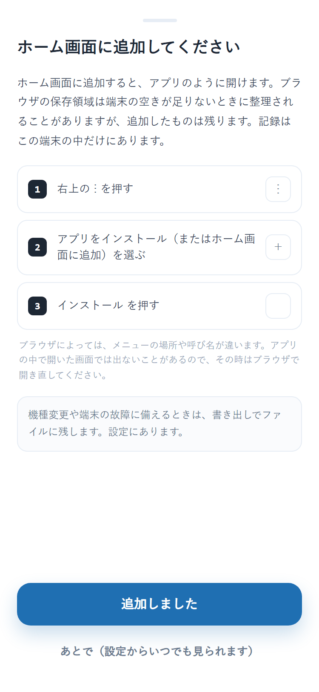

アプリの中でも、この案内が出ます（Android で開いたときの文面です）。あとで見たいときは、**設定 → ホーム画面に追加** から、いつでも開けます。

Android では、ホーム画面に追加すると YouTube の共有先に「トレ録」が出るようになります。動画を見ながら共有 → トレ録 と押すと、その動画からトレーニングメニューを作れます。

---

## 2. はじめて開いたときの三つの問い

はじめて開くと、三つだけ聞かれます。どれも飛ばせますし、あとから **設定** で変えられます。

| | 聞かれること | 答え方 |
|---|---|---|
| 1 / 3 | 記録がこの端末の中に残ること | 読んで **つづける** |
| 2 / 3 | 呼び名（任意） | 書いても、書かなくてもかまいません |
| 3 / 3 | 相棒（絵を一つ） | 選ばないのが既定です。選ぶなら絵を押すだけ |

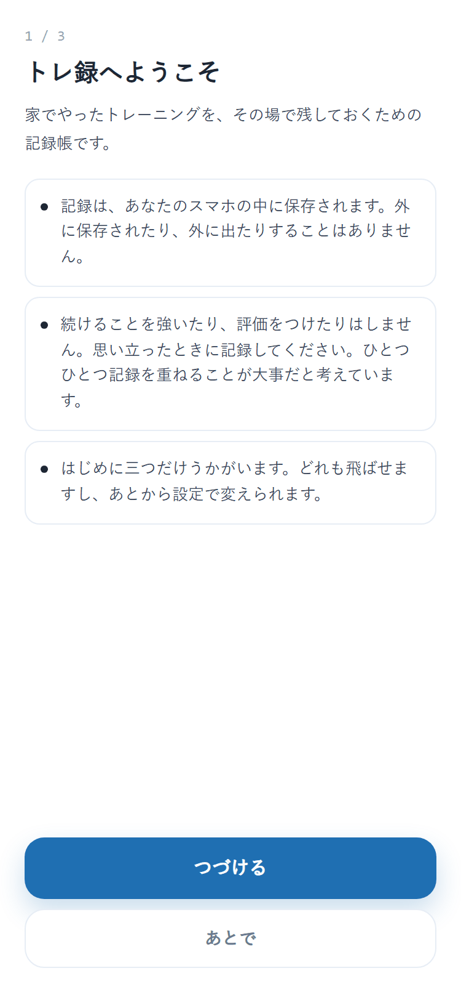 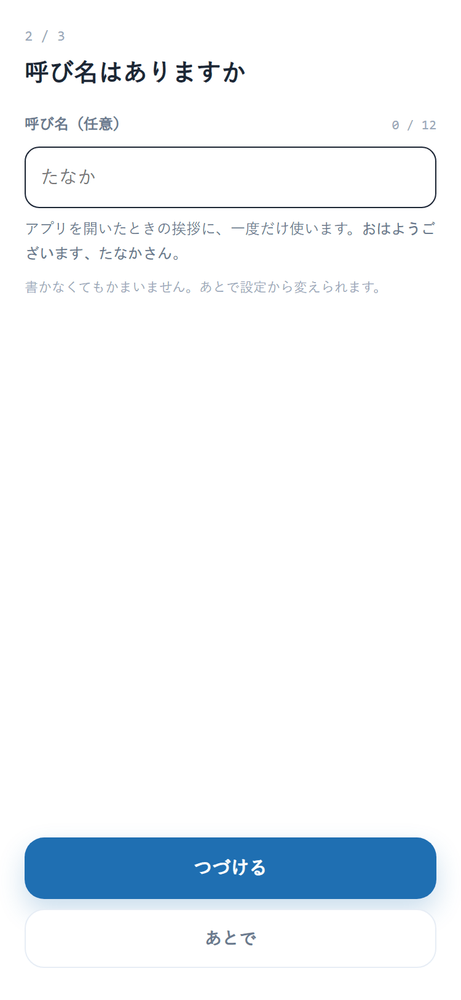 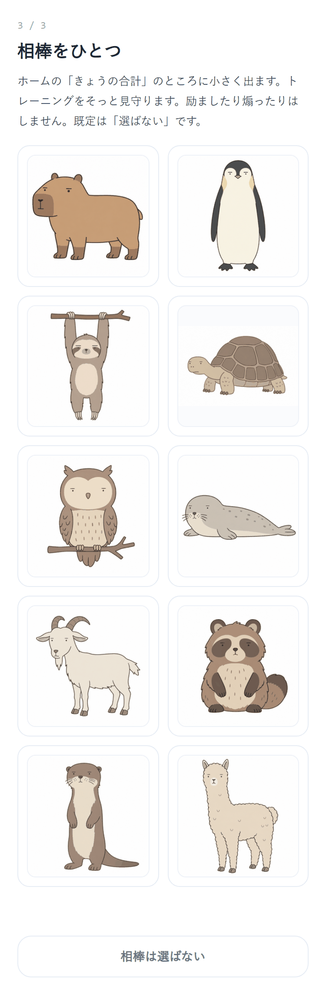

三つ答えると、ホーム画面に追加の案内が出て、そのあと最初の画面（ホーム）になります。

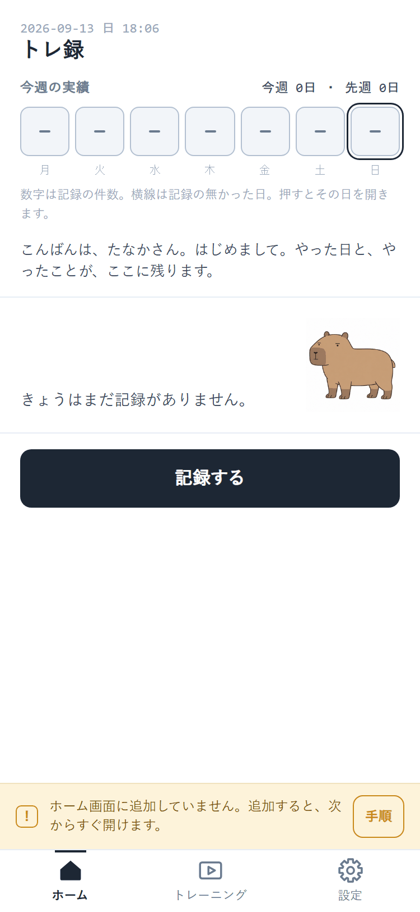

ホームには、今週の実績（曜日ごとの四角）、きょうの合計、**記録する** のボタン、きょうの記録が並びます。ホームは見るための画面で、記録は **記録する** から行います。

---

## 3. トレーニングメニューを作る

トレーニングメニューは、動画の URL と種目をまとめたものです。1つ作ると、やった日に丸を押すだけで残ります。作り方は三つあります。

### 3-1. 動画の URL を貼る（いちばん簡単）

1. ホームの **記録する** を押す（まだ1つも無いときは、貼る欄がそのまま出ます）
2. YouTube で動画を開き、**共有** から URL をコピーする
3. 欄に貼って、**URL から題名を取って作る** を押す

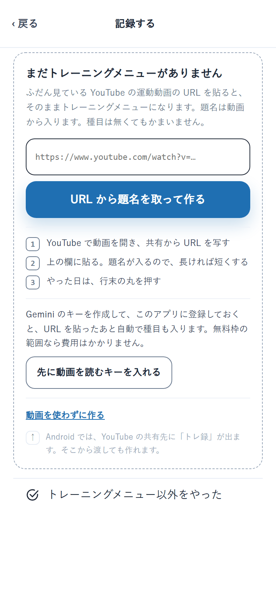

題名は動画から自動で入ります。長ければ **短くする**、自分で付けたければ **消して自分で書く** を押します。種目は無くてもかまいません。右上の **保存** で出来上がりです。

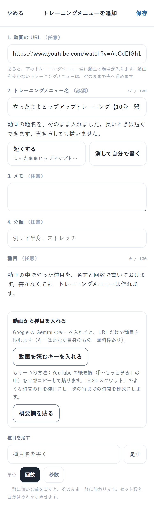

2つ目からは、下の **トレーニング** のタブを開き、一覧のいちばん下の **＋ トレーニングメニューを追加する** から同じように作ります。

### 3-2. 概要欄を貼って種目にする

動画の概要欄に「3:20 スクワット 12回」のような時間つきの行があるときは、それを種目にできます。

1. 編集画面の **概要欄を貼る** を押す
2. YouTube の概要欄の文をコピーして貼る
3. **貼った文から種目にする** を押す

時間の行が種目になり、行末の「12回」は回数に、次の行までの時間の差は秒数になります。「はじめに」「まとめ」のような行は除かれます。入った種目の名前・回数・秒数は、その場で直せます。

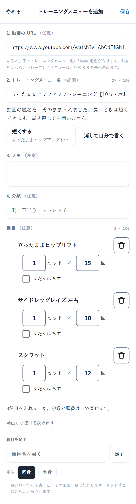

### 3-3. 動画を AI に読ませる（自分の Gemini のキーを使う）

Google の Gemini に動画そのものを読ませて、種目・セット数・回数か秒数を取り出す方法です。使うには、**あなた自身の Gemini の API キー**が要ります。

1. **設定 → 動画を読むキー** を開く
2. **Google AI Studio でキーを作る** のリンクから、キーを作る（Google のアカウントが要ります。無料枠があります）
3. 作ったキーを欄に貼り、**このキーにする** を押す

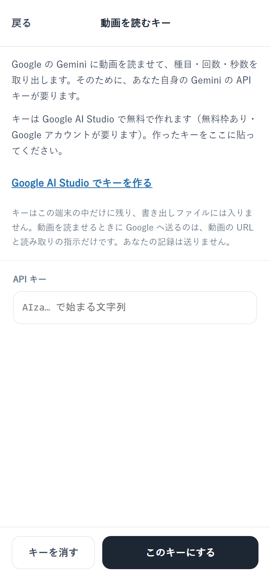

キーを入れておくと、URL を貼ったあとに **動画を AI に読ませて種目にする** が使えます。

- キーはこの端末の中にだけ残ります。書き出しファイルには入りません
- 読ませるときに Google へ送るのは、**動画の URL と読み取りの指示だけ**です。あなたの記録は送りません
- 読み取りは推測です。入った種目の名前・回数・秒数は、編集画面で確かめてください
- キーを入れなければ、この通信は一切起きません

---

## 4. やった日に記録する

### 4-1. 全部やった日：行末の丸を押す

ホームの **記録する** を押すと、トレーニングメニューの一覧が出ます。やったメニューの**行末の丸**を押すだけです。押すと丸が塗られて時刻が入り、ホームに戻ります。

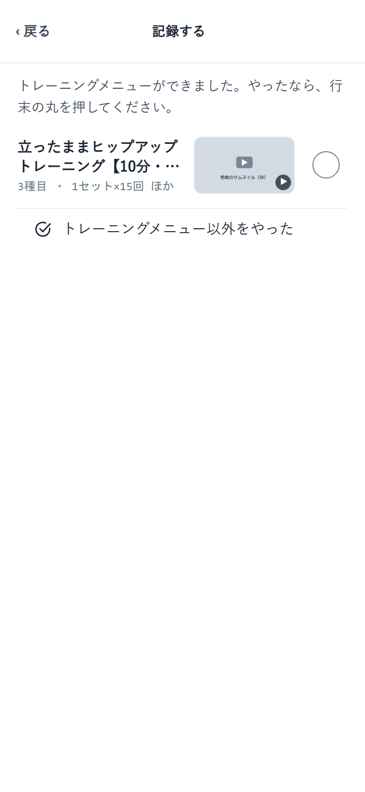 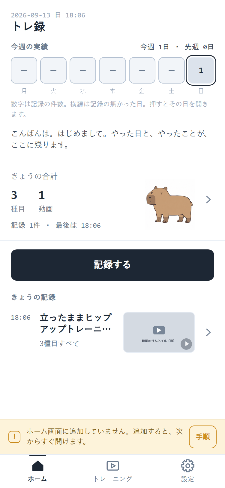

### 4-2. 一部だけやった日：行を押して種目を選ぶ

丸ではなく、**行そのもの**を押すと、種目の一覧が開きます。やった種目だけに印を付けて、下の **選んだ○種目を記録する** を押します。トレーニングメニューそのものは変わりません。

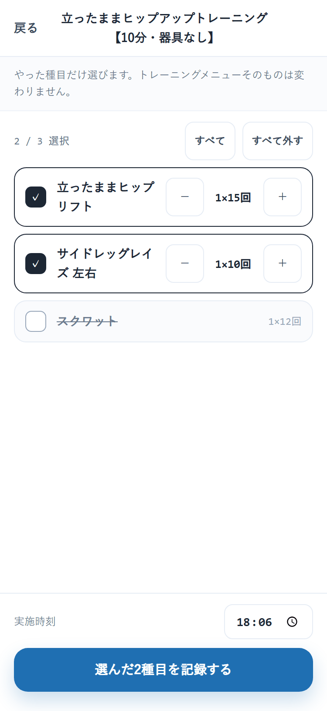

### 4-3. トレーニングメニューに無いものをやった日

一覧のいちばん下の **トレーニングメニュー以外をやった** を押します。種目の名前を書いて **足す** か、よく記録している種目から **足す** を押し、**選んだ○種目を記録** で残ります。

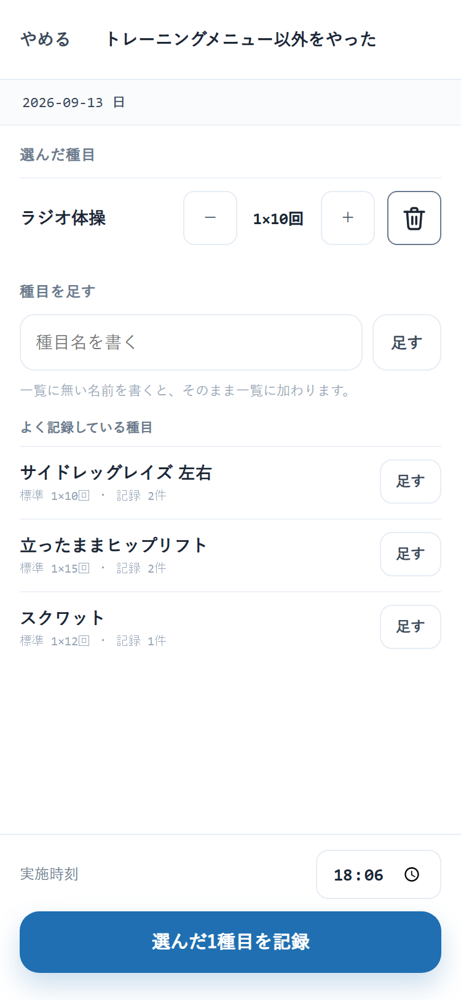

手で選んだ記録は、1日に1つです。同じ日にもう一度開くと、さきほどの種目が入った状態で開き、足した分が加わります。

---

## 5. 過去の日を直す

ホームの **今週の実績** の四角を押すと、その日から前の記録の一覧（履歴）が開きます。直したい記録の行を押すと **記録を修正** の画面になります。

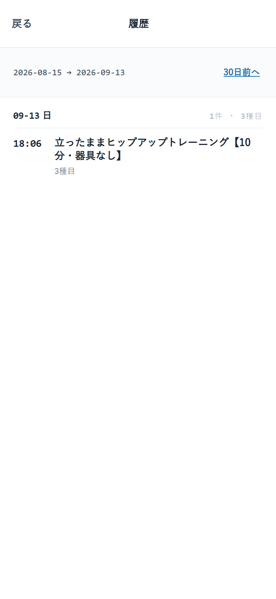 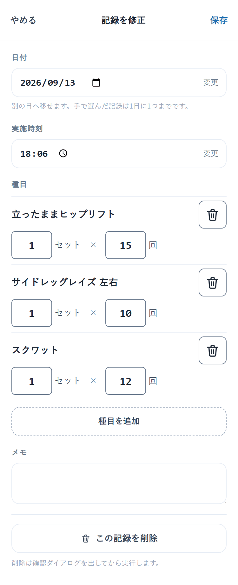

- **日付**・**実施時刻** を変えられます（別の日へ移せます）
- 種目のセット数・回数を直す、種目を消す、種目を追加する
- **メモ** を書く
- いちばん下の **この記録を削除** で消す（確認が出てから消えます）

きょうの記録は、ホームの **きょうの記録** の行を押しても同じ画面が開きます。

---

## 6. ふだんは外す

動画の概要欄や AI から自動で入った種目には、**ふだんは外す** の印が付けられます。「動画には入っているけれど、自分はこれをやらない」という種目のためのものです。

1. **トレーニング** のタブで、メニューの行を押して編集画面を開く
2. 種目の下の **ふだんは外す** に印を付けて **保存**

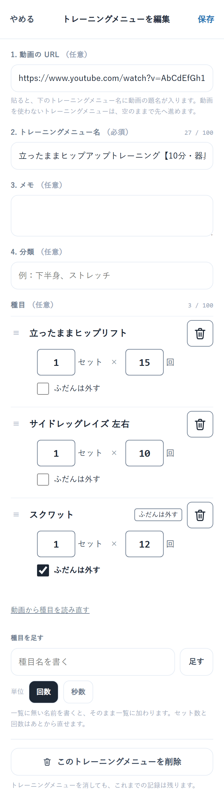

印を付けた種目は、行末の丸を押したときの記録に入りません。「一部だけ」の画面では下の方に寄せて出るので、その日だけやったときはそこで選べます。印はいつでも外せます。

---

## 7. 記録を残す（書き出し・機種変更）

**設定 → 記録を残す** を開きます。

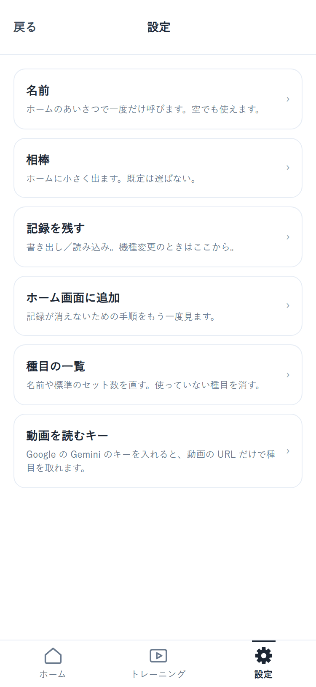 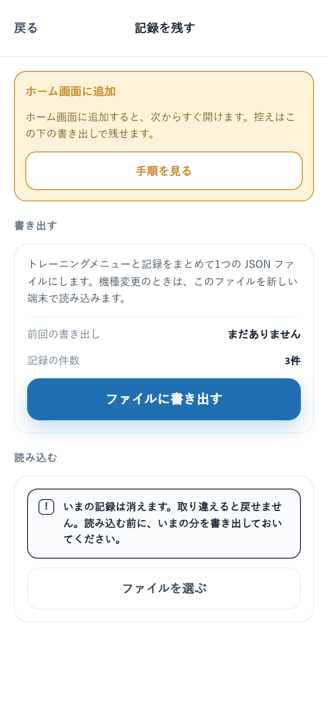

### 書き出す

**ファイルに書き出す** を押すと、トレーニングメニューと記録をまとめた1つの JSON ファイルができます。ときどき書き出して、手元に残しておくのが確実です。

### 読み込む（機種変更）

新しいスマホでトレ録を開き、**設定 → 記録を残す → ファイルを選ぶ** で、書き出したファイルを選びます。読み込むと、**いまの記録は消えて**ファイルの中身に置き換わります。読み込む前に、いまの分を書き出しておいてください。

書き出したファイルに、Gemini のキーは入りません。

---

## 8. 相棒と呼び名

**設定 → 相棒** で、絵を選び直したり、選ばないに戻したりできます。相棒はホームの右下に小さく出て、ときどきまばたきします。名前はありません。

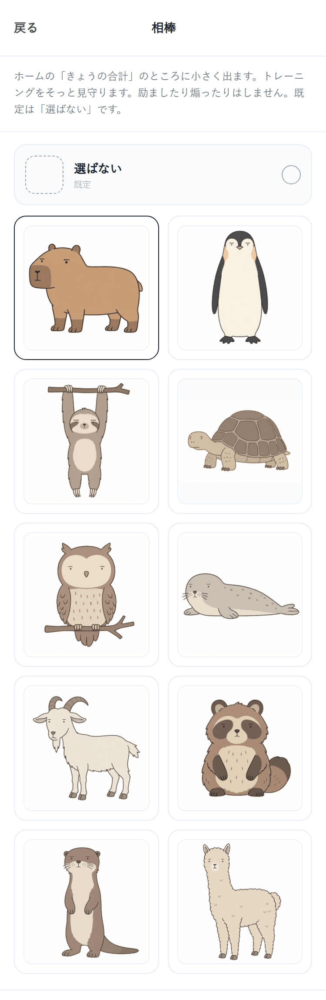 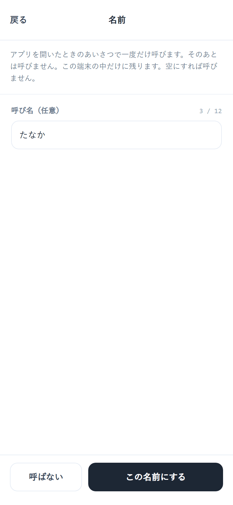

**設定 → 名前** で呼び名を変えられます。呼び名は、アプリを開いたときのあいさつで一度だけ呼びます。そのあとは呼びません。

ホームの上には、相棒からの一言が1行だけ出ます。時間帯のあいさつ、はじめての日、その日まだ記録が無いこと、久しぶりに開いたこと、今週の日数など、**見たことを言うだけ**です。

---

## 9. よくある質問

**記録はどこにありますか。**
あなたのスマホの中（ブラウザの保存領域）だけにあります。作者を含め、ほかの誰にも見えません。

**記録が消えることはありますか。**
ホーム画面に追加していれば、ふつうの使い方で消えることはありません。iPhone の Safari には「7日間使わないとブラウザに保存したデータを消す」決まりがありますが、**ホーム画面に追加したアプリはその対象外**です。念のため、ときどき **設定 → 記録を残す** で書き出しておくと確実です。

**費用はかかりますか。**
かかりません。アプリは無料です。Gemini のキーを使う場合も、Google の無料枠の範囲なら費用はかかりません。

**動画は保存されますか。**
されません。動画は YouTube で開きます。トレ録が持つのは URL と題名だけです。

**外に送られる情報はありますか。**
記録は送りません。アプリが外と通信するのは、動画のサムネイルを表示するとき（YouTube）、URL から題名を取るとき（YouTube）、そして自分でキーを入れて動画を AI に読ませるとき（Google）の三つだけです。

**点数や連続日数は出ますか。**
出ません。やった日と、やったことが、そのまま残るだけです。

**別のスマホでも同じ記録を見られますか。**
自動では同期しません。**設定 → 記録を残す** で書き出したファイルを、別のスマホで読み込んでください。

**アプリを消したら記録はどうなりますか。**
ホーム画面のアイコンを消しても、ブラウザの保存領域に残っていれば、もう一度開くと戻ります。ブラウザのサイトデータを消すと記録も消えます。消す前に書き出してください。

---

このアプリは MIT ライセンスで公開しています。中身は https://github.com/memory2meaning-lgtm/toreroku にあります。
